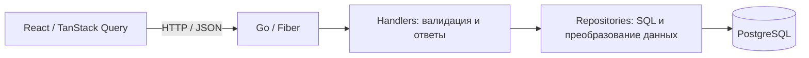

# Squadragram

Учебный full-stack проект: каталог игровых персонажей и их способностей с REST API на Go и интерфейсом на React + TypeScript.

## Возможности

- Создание персонажей, получение списка и поиск по UUID через REST API.
- Создание способностей с привязкой к персонажу и получение его способностей.
- Проверка JSON, UUID, обязательных полей, ролей и типов способностей.
- Единый формат ошибок API с кодами `400`, `404`, `409` и `500`.
- PostgreSQL: внешние ключи, уникальные ограничения, enum-типы, индексы и триггеры обновления времени изменения.
- Интерфейс каталога с карточками персонажей и состояниями загрузки и ошибки.
- Локальный запуск backend и базы данных через Docker Compose.

**Статус: в разработке.** MinIO включён в инфраструктуру, но загрузка и выдача медиа через API ещё не реализованы.

## Стек

| Часть проекта | Технологии |
| --- | --- |
| Backend | Go 1.25, Fiber v3, pgx v5 |
| База данных | PostgreSQL 17, SQL-миграции |
| Frontend | React 19, TypeScript, TanStack Start, Router и Query |
| Стили и инструменты | Tailwind CSS 4, Vite 8, Biome |
| Инфраструктура | Docker, Docker Compose, MinIO (заготовка для медиа) |
| Тестирование | Go testing, httptest, подмены репозиториев |

## Архитектура



Обработчики зависят от интерфейсов репозиториев, поэтому контракты API можно проверять без запущенной базы данных. Репозитории выполняют параметризованные SQL-запросы через `pgxpool`. Ошибки оборачиваются с контекстом и преобразуются в HTTP-ответы общим модулем.

Для внешних запросов используется UUID, а связи между таблицами строятся на числовых ключах. При создании способности репозиторий находит внутренний ID персонажа по переданному UUID.

```text
.
├── docker-compose.yml
├── squadragram-backend/
│   ├── cmd/                 # Точка входа HTTP-сервера
│   ├── internal/
│   │   ├── handler/         # Маршруты, валидация, ответы и тесты
│   │   ├── model/           # Модели, DTO и enum-типы
│   │   └── repository/      # Доступ к данным и SQL-запросы
│   ├── migrations/          # Начальная схема и обратная миграция
│   └── pkg/                 # Вспомогательные пакеты
└── squadragram-frontend/
    └── src/
        ├── api/             # HTTP-клиент
        ├── components/      # Каталог, карточки и общие компоненты
        ├── hooks/           # Запросы через TanStack Query
        ├── routes/          # Файловые маршруты
        └── shared/types/    # Типы данных интерфейса
```

## Быстрый старт

Понадобятся Docker с Docker Compose и Node.js 22.12+ с npm. Для запуска backend вне контейнера нужен Go 1.25+.

### 1. Запустить backend и PostgreSQL

Из корня репозитория:

```sh
docker compose up --build -d postgres backend
```

Начальная SQL-миграция применяется автоматически **только при первом создании пустого тома PostgreSQL**. Демо-данных в миграции нет, поэтому каталог изначально пустой.

### 2. Запустить интерфейс

В отдельном терминале:

```sh
cd squadragram-frontend
npm ci
npm run dev
```

| Сервис | Адрес |
| --- | --- |
| Интерфейс | http://localhost:3000 |
| API персонажей | http://localhost:3001/api/characters |
| PostgreSQL | localhost:5432 |

Frontend обращается к `http://localhost:3001/api`, заданному в `src/api/characters.ts`.

### 3. Добавить данные для демонстрации

Пример для PowerShell:

```powershell
$character = Invoke-RestMethod -Method Post `
  -Uri 'http://localhost:3001/api/characters' `
  -ContentType 'application/json' `
  -Body '{"name":"Demo Hero","description":"Персонаж для демонстрации API","role":"TANK"}'

Invoke-RestMethod -Uri "http://localhost:3001/api/characters/$($character.uuid)"

$skillBody = @{
  name = 'Shield'
  description = 'Защитная способность'
  type = 'SKILL'
  character_uuid = $character.uuid
} | ConvertTo-Json

Invoke-RestMethod -Method Post `
  -Uri 'http://localhost:3001/api/skills' `
  -ContentType 'application/json' `
  -Body $skillBody

Invoke-RestMethod -Uri "http://localhost:3001/api/characters/$($character.uuid)/skills"
```

Обновите главную страницу, чтобы увидеть персонажа в каталоге. Повторное создание записи с тем же именем вернёт `409 Conflict`.

Остановить контейнеры с сохранением данных:

```sh
docker compose down
```

### Опционально: MinIO

```sh
docker compose up -d minio
```

Консоль: http://localhost:9000, S3 endpoint: http://localhost:9005. Локальные учётные данные: `admin` / `12345678`. Backend пока не использует хранилище. Пароли в Compose предназначены для локальной разработки.

## API

Базовый путь: `/api`.

| Метод | Маршрут | Назначение |
| --- | --- | --- |
| GET | `/characters` | Список персонажей |
| GET | `/characters/:uuid` | Персонаж по UUID |
| POST | `/characters` | Создание персонажа |
| GET | `/skills` | Список способностей |
| GET | `/skills/:uuid` | Способность по UUID |
| POST | `/skills` | Создание способности для персонажа |
| GET | `/characters/:uuid/skills` | Способности персонажа |

Роли: `DAMAGE`, `TANK`, `TECHNICAL`, `MELEE`, `RANGED`.

Типы способностей: `PASSIVE`, `RUSH_ATTACK`, `SKILL`, `SUPER_ATTACK`, `MAX_SUPER_ATTACK`, `TRANSFORMATION`.

Создание возвращает `201 Created`. Ошибки имеют форму `{"error":"сообщение"}`. Пустые списки возвращаются как `[]`; запрос способностей неизвестного персонажа также возвращает пустой список. Обновление, удаление и фильтрация на сервере пока не реализованы. Авторизация отсутствует.

## Разработка и проверки

Локальный запуск backend при работающем PostgreSQL:

```sh
cd squadragram-backend
go run ./cmd
```

Сервер читает переменные окружения процесса; `.env` автоматически не загружается.

| Переменная | Значение по умолчанию |
| --- | --- |
| `PORT` | `3001` |
| `DATABASE_URL` | Если задана, имеет приоритет над отдельными параметрами PostgreSQL |
| `POSTGRES_HOST` | `localhost` |
| `POSTGRES_PORT` | `5432` |
| `POSTGRES_USER` | `postgres` |
| `POSTGRES_PASSWORD` | `postgres` |
| `POSTGRES_DBNAME` | `postgres` |

Тесты backend:

```sh
cd squadragram-backend
go test ./...
```

Тесты обработчиков проверяют создание и чтение данных, валидацию запросов, связь способности с персонажем, преобразование ошибок репозитория и сериализацию пустых списков. Они используют подмены репозиториев и не требуют PostgreSQL; интеграционные тесты базы данных пока не реализованы.

Проверки frontend из каталога `squadragram-frontend`:

```sh
npm run check
npm run build
```

## Дальнейшее развитие

- [ ] Согласовать UUID между маршрутами frontend и API.
- [ ] Подключить способности к странице персонажа и настроить выдачу изображений.
- [ ] Добавить фильтрацию, поиск и пагинацию каталога.
- [ ] Реализовать редактирование и удаление, авторизацию и административный интерфейс.
- [ ] Подключить MinIO и завершить работу со скинами и эмоциями.
- [ ] Добавить интеграционные тесты с PostgreSQL и проверки в CI.
- [ ] Подготовить демо-данные, скриншоты и публичный демонстрационный стенд.

## Описание для резюме

> **Squadragram — учебный full-stack каталог игровых персонажей.** Реализованы REST API на Go/Fiber для создания и чтения персонажей и способностей, реляционная схема PostgreSQL, валидация запросов и единая обработка ошибок. Написаны тесты HTTP-обработчиков с подменами репозиториев, настроен запуск backend и базы данных через Docker Compose. Разработан базовый интерфейс каталога на React/TypeScript с TanStack Query и файловой маршрутизацией.
